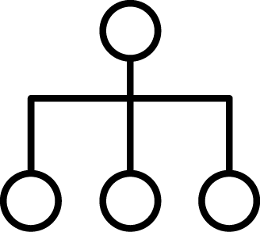
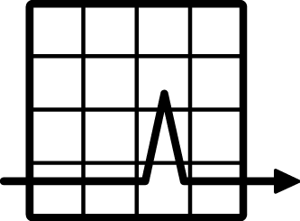

<h2 id="project_description">{{ site.description }}</h2>

&nbsp;
&nbsp;

  

  <figure>
    
    <h2>Distributed</h2>
    <figcaption>Drive the load from many nodes.</figcaption>
    </figure>
  

   

  <figure>
    
    <h2>Accurate</h2>
    <figcaption>All operations are async to avoid the <a href="https://www.azul.com/files/HowNotToMeasureLatency_LLSummit_NYC_12Nov2013.pdf">coordinated-omission fallacy</a></figcaption>
    </figure>
  

  

  <figure>
    
    <h2>Versatile</h2>
    <figcaption>You can express complex scenarios either in YAML or through pluggable steps.</figcaption>
    </figure>
  

  

  <figure>
    
    <h2>Low-Allocation</h2>
    <figcaption>Internally we try to allocate as little as possible on the critical code paths to not let garbage-collector disturb the operations.</figcaption>
    </figure>
  

&nbsp;
&nbsp;

Hyperfoil is licensed under [Apache License 2.0](http://www.apache.org/licenses/LICENSE-2.0)

